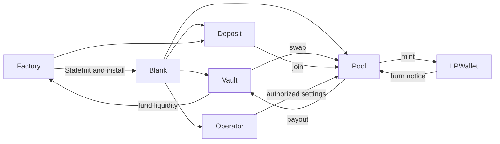

# DeDust Classic DEX

Ten FunC contracts, grouped by their actual Factory / Vault / Pool / LP message flow.

| Folder | Role |
| --- | --- |
| [factory](contracts/factory/main.fc) | Implementation registry, pool/vault/deposit deployment, ownership and upgrades |
| [blank](contracts/blank/main.fc) | Authenticated loader; installs code and immediately executes constructor 58662 |
| [native-vault](contracts/native-vault/main.fc) | Native TON custody, swap input and pool payouts |
| [jetton-vault](contracts/jetton-vault/main.fc) | Jetton wallet resolution, transfer notifications and refunds |
| [pool-v7](contracts/pool-v7/main.fc) | Original pool; volatile and stable invariant calculations |
| [pool-v8](contracts/pool-v8/main.fc) / [pool-v9](contracts/pool-v9/main.fc) | Installed pool revisions with launch-time controls |
| [liquidity-deposit](contracts/liquidity-deposit/main.fc) | Collects two assets before requesting LP minting |
| [lp-wallet](contracts/lp-wallet/main.fc) | LP balances, owner transfers, burn notification and bounce restoration |
| [operator](contracts/operator/main.fc) | Role-specific authority, beneficiary and timelocked withdrawals |

The pool's Factory-derived address ties vault payouts and LP burn messages to the
correct peer. Blank is an installation stage, so a deployment address usually runs
a different implementation after its first successful message.

From this folder, `npm run build` compiles with pinned FunC 0.4.4 and fails on any BOC
difference. `npm test` prepares those artifacts and runs Acton 1.2.1. Both commands
use the shared lockfile installed by `npm ci` in `projects`.

Tests cover volatile/stable math, floor rounding, fee counters, swap rejection,
mint/burn conservation, authentic deployment through Blank, forged senders, temporal
boundaries and failed upgrade rollback. `mainnet-installation.test.tolk` additionally
replays a saved Factory message which installs the byte-exact Pool V9.

All contract entry points remain editable FunC. Explicit method IDs, tuple ABI
primitives and evaluation barriers preserve historical TVM behavior. Shared standard
library: [`../libraries/func/stdlib.fc`](../libraries/func/stdlib.fc).
Mainnet addresses and verifier URLs: [`../mainnet-addresses.json`](../mainnet-addresses.json).
