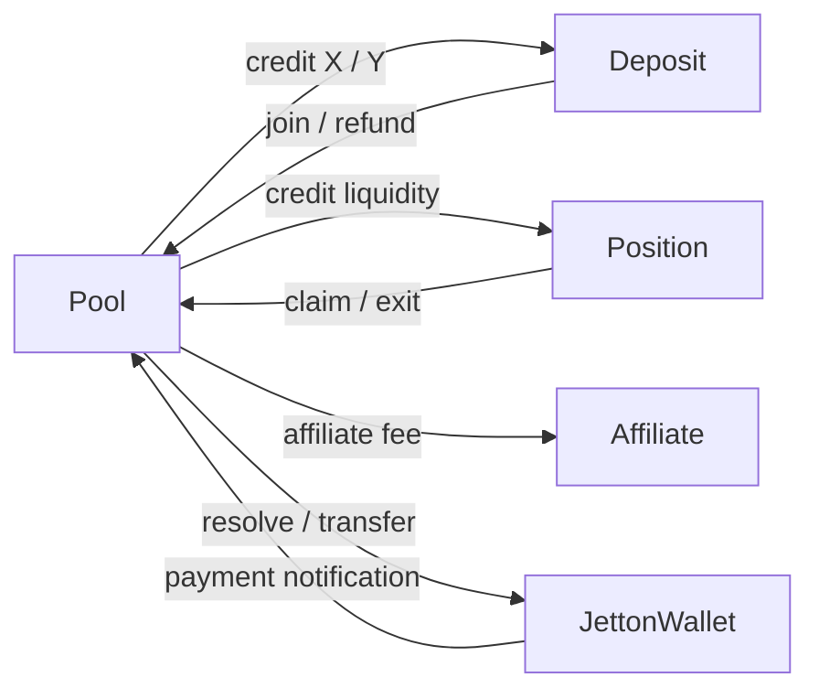

# DeDust CPMM

Five Tolk contracts form the liquidity/position/fee system.

| Folder | Role |
| --- | --- |
| [pool-v1](contracts/pool-v1/main.tolk) | First fee-split revision; shares common codecs and math with V2 |
| [pool-v2](contracts/pool-v2/main.tolk) | Pool dispatch, swaps, liquidity, reward programs, settlement and routing |
| [deposit](contracts/deposit/main.tolk) | Transient two-asset collection; joins or refunds, then destroys itself |
| [position](contracts/position/main.tolk) | LP position, fee/reward checkpoints, claims and withdrawals |
| [affiliate-account](contracts/affiliate-account/main.tolk) | Partner/referrer activation, accumulated fees and owner withdrawal |

`pool-v2` separates storage, incoming message types, handlers, math, wallet resolution,
payout/routing, rewards and deployment primitives. V1 explicitly imports those common
modules while retaining its own processing, handler and transfer differences.

Run `npm run build` or `npm test` here after `npm ci` in the parent workspace. Exact
contract compilation uses Tolk 1.4; modern Acton 1.2.1 runs the tests. `npm run fmt`
preserves import order, which determines legacy union tags.

Tests cover Q120 checkpoints, reward boundaries, swap rounding, protocol/creator/LP
fee splitting, slippage refunds, routing, authentic position/deposit callbacks and
source-built library references. The archived deposit replay uses both actual
mainnet messages, reproduces the exact outgoing join body and account destruction,
and verifies that a forged pool cannot settle the deposit.

Public data: [`../mainnet-addresses.json`](../mainnet-addresses.json),
[saved message evidence](../evidence/README.md). A disappeared deposit is expected
after settlement; its deployment StateInit remains in the saved transaction.
