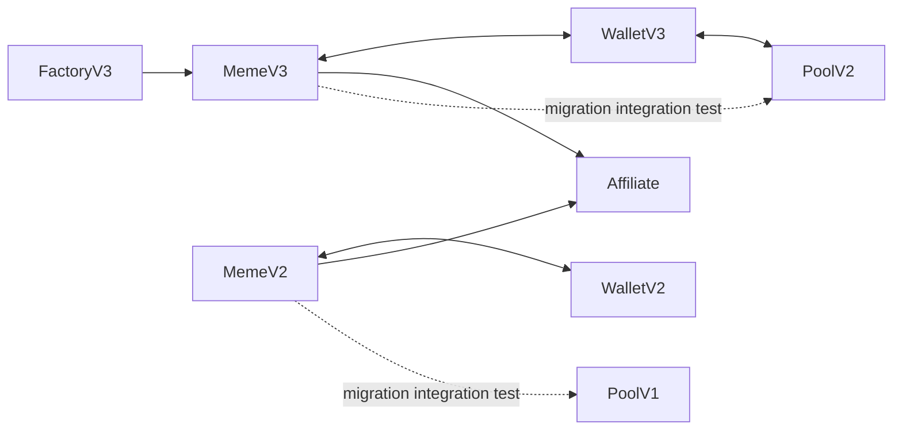

# Uranus launchpad

| Folder | Role |
| --- | --- |
| [factory-v3](contracts/factory-v3/main.tolk) | Preset/custom launch configuration and sharded master deployment |
| [meme-v2](contracts/meme-v2/main.tolk) | Earlier bonding curve and migration to CPMM Pool V1 |
| [meme-v3](contracts/meme-v3/main.tolk) | Newer bonding curve, fee claims and migration to CPMM Pool V2 |
| [meme-wallet-v2](contracts/meme-wallet-v2/main.tolk) | Earlier sharded jetton transfer/burn/sell wallet |
| [meme-wallet-v3](contracts/meme-wallet-v3/main.tolk) | Newer wallet with stricter message-tail validation |
| [common](contracts/common) | Versioned StateInit hashing shared by masters and wallets |

The project imports the **source-built** CPMM contracts from `../cpmm`. Their embedded
library hashes must match exactly; replacing a dependency with a merely equivalent
new compiler output would change derived addresses and break peer authentication.

Solid edges have examples in the saved mainnet sample; dotted migration edges are
explicit source relationships exercised by local full-flow tests.

`npm run build` builds Uranus and the necessary CPMM dependencies with pinned Tolk
1.4. `npm test` registers those libraries only inside Acton's local emulator. Tests
cover initial buys, sells through real wallets, supply/balance conservation, slippage,
fees, complete V2/V3 migrations and sharded address calculation. The saved Factory
deployment replay verifies initialization and refusal of a second initialization.

Addresses and published verifier links are in
[`../mainnet-addresses.json`](../mainnet-addresses.json). Source compatibility
primitives are explained in [the workspace specification](../NORMALIZATION.md).
